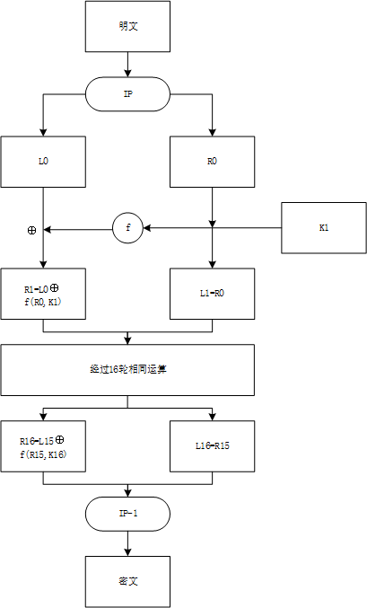

# DES 的设计与实现

## DES 算法简介

DES 算法为密码体制中的对称密码体制,又被称为美国数据加密标准.

DES 是一个分组加密算法,典型的 DES 以 64 位为分组对数据加密,加密和解密用的是同一个算法.

密钥长 64 位,密钥事实上是 56 位参与 DES 运算(第 8、16、24、32、40、48、56、64 位是校验位,使得每个密钥都有奇数个 1),分组后的明文组和 56 位的密钥按位替代或交换的方法形成密文组.

DES 算法的主要流程如下图所示,本文按照流程依次介绍每个模块.



## 初始置换 IP

初始置换 IP 目的是将输入的 64 位数据块按位重新组合,并把输出分为$L_0,R_0$两部分,每部分各长 32 位.

置换规则如下表所示:

```python
IP = [58, 50, 42, 34, 26, 18, 10, 2,
      60, 52, 44, 36, 28, 20, 12, 4,
      62, 54, 46, 38, 30, 22, 14, 6,
      64, 56, 48, 40, 32, 24, 16, 8,
      57, 49, 41, 33, 25, 17, 9, 1,
      59, 51, 43, 35, 27, 19, 11, 3,
      61, 53, 45, 37, 29, 21, 13, 5,
      63, 55, 47, 39, 31, 23, 15, 7]
```

表中的数字代表新数据中此位置的数据在原数据中的位置,即原数据块的第 58 位放到新数据的第 1 位,第 50 位放到第 2 位,……依此类推,第 7 位放到第 64 位.置换后的数据分为$L_0$和$R_0$两部分,$L_0$为新数据的左 32 位,$R_0$为新数据的右 32 位.

要注意一点,位数是从左边开始数的,即最左边的位为 1,最右边的位为 64.

## 置换选择

不考虑每个字节的第 8 位,DES 的密钥由 64 位减至 56 位,每个字节的第 8 位作为奇偶校验位.产生的 56 位密钥由下表生成(注意表中没有 8,16,24,32,40,48,56 和 64 这 8 位):

```python
PC_1 = [57, 49, 41, 33, 25, 17, 9,
        1, 58, 50, 42, 34, 26, 18,
        10, 2, 59, 51, 43, 35, 27,
        19, 11, 3, 60, 52, 44, 36,
        63, 55, 47, 39, 31, 23, 15,
        7, 62, 54, 46, 38, 30, 22,
        14, 6, 61, 53, 45, 37, 29,
        21, 13, 5, 28, 20, 12, 4]
```

在 DES 的每一轮中,从 56 位密钥产生出不同的 48 位子密钥,确定这些子密钥的方式如下:

1. 将 56 位的密钥分成两部分,每部分 28 位.

2. 根据轮数,这两部分分别循环左移 1 位或 2 位.每轮移动的位数如下表:

```python
SHIFT = [1, 1, 2, 2, 2, 2, 2, 2, 1, 2, 2, 2, 2, 2, 2, 1]
```

移动后,从 56 位中选出 48 位.这个过程中,既置换了每位的顺序,又选择了子密钥.置换规则如下表(注意表中没有 9,18,22,25,35,38,43 和 54 这 8 位):

```python
PC_2 = [14, 17, 11, 24, 1, 5,
        3, 28, 15, 6, 21, 10,
        23, 19, 12, 4, 26, 8,
        16, 7, 27, 20, 13, 2,
        41, 52, 31, 37, 47, 55,
        30, 40, 51, 45, 33, 48,
        44, 49, 39, 56, 34, 53,
        46, 42, 50, 36, 29, 32]
```

## 选择扩展运算 E

选择扩展运算目标是 IP 置换后获得的右半部分$R_0$,将 32 位输入扩展为 48 位(分为 4 位 ×8 组)输出.

选择扩展运算目的有两个:生成与密钥相同长度的数据以进行异或运算;提供更长的结果,在后续的代换运算中可以进行压缩.

选择扩展运算原理如下表:

```python
E = [32, 1, 2, 3, 4, 5,
     4, 5, 6, 7, 8, 9,
     8, 9, 10, 11, 12, 13,
     12, 13, 14, 15, 16, 17,
     16, 17, 18, 19, 20, 21,
     20, 21, 22, 23, 24, 25,
     24, 25, 26, 27, 28, 29,
     28, 29, 30, 31, 32, 1]
```

表中的数字代表位,最边上的两列数据是扩展的数据,可以看出,扩展的数据是从相邻两组分别取靠近的一位,4 位变为 6 位.靠近 32 位的位为 1,靠近 1 位的位为 32.表中第二行的 4 取自上组中的末位,9 取自下组中的首位.

选择扩展运算之后,右半部分数据$R_0$变为 48 位,与置换选择得到的轮密钥进行异或.

## S 盒代换

置换选择后的密钥与选择扩展运算分组异或以后得到 48 位的数据,将这个数据送入 S 盒,进行代换运算.代换由 8 个不同的 S 盒完成,每个 S 盒有 6 位输入 4 位输出.48 位输入分为 8 个 6 位的分组,一个分组对应一个 S 盒,对应的 S 盒对各组进行代换操作.

一个 S 盒就是一个 4 行 16 列的表,盒中的每一项都是一个 4 位的数.S 盒的 6 个输入确定了其对应的输出在哪一行哪一列,输入的高低两位做为行数`row`,中间四位做为列数`col`,在`S_BOX`中查找第`row`行`col`列对应的数据(<32).

S 盒如下:

```python
S_BOX = [[14, 4, 13, 1, 2, 15, 11, 8, 3, 10, 6, 12, 5, 9, 0, 7,
          0, 15, 7, 4, 14, 2, 13, 1, 10, 6, 12, 11, 9, 5, 3, 8,
          4, 1, 14, 8, 13, 6, 2, 11, 15, 12, 9, 7, 3, 10, 5, 0,
          15, 12, 8, 2, 4, 9, 1, 7, 5, 11, 3, 14, 10, 0, 6, 13],
         [15, 1, 8, 14, 6, 11, 3, 4, 9, 7, 2, 13, 12, 0, 5, 10,
          3, 13, 4, 7, 15, 2, 8, 14, 12, 0, 1, 10, 6, 9, 11, 5,
          0, 14, 7, 11, 10, 4, 13, 1, 5, 8, 12, 6, 9, 3, 2, 15,
          13, 8, 10, 1, 3, 15, 4, 2, 11, 6, 7, 12, 0, 5, 14, 9],
         [10, 0, 9, 14, 6, 3, 15, 5, 1, 13, 12, 7, 11, 4, 2, 8,
          13, 7, 0, 9, 3, 4, 6, 10, 2, 8, 5, 14, 12, 11, 15, 1,
          13, 6, 4, 9, 8, 15, 3, 0, 11, 1, 2, 12, 5, 10, 14, 7,
          1, 10, 13, 0, 6, 9, 8, 7, 4, 15, 14, 3, 11, 5, 2, 12],
         [7, 13, 14, 3, 0, 6, 9, 10, 1, 2, 8, 5, 11, 12, 4, 15,
          13, 8, 11, 5, 6, 15, 0, 3, 4, 7, 2, 12, 1, 10, 14, 9,
          10, 6, 9, 0, 12, 11, 7, 13, 15, 1, 3, 14, 5, 2, 8, 4,
          3, 15, 0, 6, 10, 1, 13, 8, 9, 4, 5, 11, 12, 7, 2, 14],
         [2, 12, 4, 1, 7, 10, 11, 6, 8, 5, 3, 15, 13, 0, 14, 9,
          14, 11, 2, 12, 4, 7, 13, 1, 5, 0, 15, 10, 3, 9, 8, 6,
          4, 2, 1, 11, 10, 13, 7, 8, 15, 9, 12, 5, 6, 3, 0, 14,
          11, 8, 12, 7, 1, 14, 2, 13, 6, 15, 0, 9, 10, 4, 5, 3],
         [12, 1, 10, 15, 9, 2, 6, 8, 0, 13, 3, 4, 14, 7, 5, 11,
          10, 15, 4, 2, 7, 12, 9, 5, 6, 1, 13, 14, 0, 11, 3, 8,
          9, 14, 15, 5, 2, 8, 12, 3, 7, 0, 4, 10, 1, 13, 11, 6,
          4, 3, 2, 12, 9, 5, 15, 10, 11, 14, 1, 7, 6, 0, 8, 13],
         [4, 11, 2, 14, 15, 0, 8, 13, 3, 12, 9, 7, 5, 10, 6, 1,
          13, 0, 11, 7, 4, 9, 1, 10, 14, 3, 5, 12, 2, 15, 8, 6,
          1, 4, 11, 13, 12, 3, 7, 14, 10, 15, 6, 8, 0, 5, 9, 2,
          6, 11, 13, 8, 1, 4, 10, 7, 9, 5, 0, 15, 14, 2, 3, 12],
         [13, 2, 8, 4, 6, 15, 11, 1, 10, 9, 3, 14, 5, 0, 12, 7,
          1, 15, 13, 8, 10, 3, 7, 4, 12, 5, 6, 11, 0, 14, 9, 2,
          7, 11, 4, 1, 9, 12, 14, 2, 0, 6, 10, 13, 15, 3, 5, 8,
          2, 1, 14, 7, 4, 10, 8, 13, 15, 12, 9, 0, 3, 5, 6, 11]]
```

例如,假设 S 盒 8 的输入为`110011`,第 1 位和第 6 位组合为`11`,对应于 S 盒 8 的第 3 行;第 2 位到第 5 位为`1001`,对应于 S 盒 8 的第 9 列.S 盒 8 的第 3 行第 9 列的数字为`12`,因此用`1100`来代换`110011`.注意,S 盒的行列计数都是从 0 开始.

代换过程产生 8 个 4 位的分组,组合在一起形成 32 位数据.

S 盒代换时 DES 算法的关键步骤,所有的其他的运算都是线性的,易于分析,而 S 盒是非线性的,相比于其他步骤,提供了更好安全性.

## 置换运算 P

S 盒代换运算的 32 位输出按照 P 盒进行置换.该置换把输入的每位映射到输出位,任何一位不能被映射两次,也不能被略去,映射规则如下表:

```python
P = [16, 7, 20, 21, 29, 12, 28, 17,
     1, 15, 23, 26, 5, 18, 31, 10,
     2, 8, 24, 14, 32, 27, 3, 9,
     19, 13, 30, 6, 22, 11, 4, 25]
```

表中的数字代表原数据中此位置的数据在新数据中的位置,即原数据块的第 16 位放到新数据的第 1 位,第 7 位放到第 2 位,……依此类推,第 25 位放到第 32 位.

最后,P 盒置换的结果与最初的 64 位分组左半部分$L_0$异或,然后左、右半部分交换,接着开始另一轮.

## 逆初始置换$IP^{-1}$

逆初始置换$IP^{-1}$是初始置换 IP 的逆过程,DES 最后一轮后,左、右两半部分并未进行交换,而是两部分合并形成一个分组做为逆初始置换的输入.逆初始置换规则如下表:

```python
IP_1 = [40, 8, 48, 16, 56, 24, 64, 32,
        39, 7, 47, 15, 55, 23, 63, 31,
        38, 6, 46, 14, 54, 22, 62, 30,
        37, 5, 45, 13, 53, 21, 61, 29,
        36, 4, 44, 12, 52, 20, 60, 28,
        35, 3, 43, 11, 51, 19, 59, 27,
        34, 2, 42, 10, 50, 18, 58, 26,
        33, 1, 41, 9, 49, 17, 57, 25]
```

经过以上步骤,就可以得到密文了.
